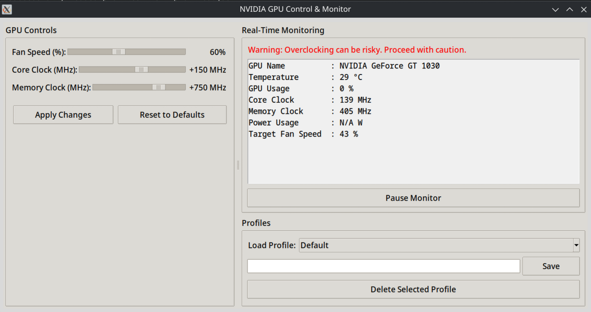

# NVIDIA GPU Control & Monitor


Uma aplicação gráfica para Linux para monitorizar e controlar as definições de placas gráficas NVIDIA, incluindo a velocidade da ventoinha, e os offsets do core clock e memory clock.

Este projeto foi construído de raiz como uma aplicação Python, utilizando o framework Tkinter para a interface gráfica (GUI). Ele fornece uma interface amigável para tarefas comuns de overclock e monitorização que, tipicamente, exigiriam operações complexas na linha de comandos.

---

## Funcionalidades

*   **Monitorização em Tempo Real:** Um painel que exibe as principais estatísticas da GPU, atualizadas a cada dois segundos:
    *   Nome da GPU
    *   Temperatura
    *   Velocidade da Ventoinha
    *   Utilização da GPU
    *   Velocidade do Core & Memory Clock
    *   Consumo de Energia
*   **Controlos da GPU:** Sliders simples para ajustar:
    *   **Velocidade da Ventoinha:** Defina uma percentagem de velocidade manual para a ventoinha.
    *   **Core Clock Offset:** Aplique um offset positivo ao core clock da GPU.
    *   **Memory Clock Offset:** Aplique um offset positivo ao memory clock da GPU.
*   **Gestão de Perfis:**
    *   Guarde as suas configurações favoritas como perfis personalizados.
    *   Carregue e aplique perfis rapidamente a partir de um menu dropdown.
    *   Apague perfis que já não necessita.
*   **Interface de Linha de Comandos (CLI):**
    *   Aplique configurações sem iniciar a interface gráfica, perfeito para scripts.
    *   Suporta os argumentos `--fan`, `--core`, `--mem`, e `--reset`.
*   **Seguro & Robusto:**
    *   Não exige que a aplicação inteira seja executada como root.
    *   Utiliza `pkexec` e uma regra Polkit granular para executar comandos privilegiados de forma segura.
    *   Inclui verificação de dependências no arranque para guiar o utilizador.

---

## Captura de Ecrã

*(Espaço reservado para adicionar uma captura de ecrã da aplicação)*



---

## Instalação

Esta aplicação é **exclusivamente para Linux** e requer que os drivers proprietários da NVIDIA estejam instalados.

### Passo 1: Clonar o Repositório

Primeiro, clone este repositório para a sua máquina local.

```bash
git clone https://github.com/mefrraz/nvidiaoc.git
cd nvidiaoc
```

### Passo 2: Instalar Dependências

A aplicação requer a biblioteca Tkinter do Python para a GUI e o `xhost` para gerir as permissões do servidor gráfico.

**Em Debian / Ubuntu:**
```bash
sudo apt-get update
sudo apt-get install -y python3-tk x11-xserver-utils
```

**Em Arch Linux / Cachy OS / Manjaro:**
```bash
sudo pacman -Syu --noconfirm tk xorg-xhost
```

**Em Fedora / CentOS / RHEL:**
```bash
sudo dnf install -y python3-tkinter xorg-xhost
```

### Passo 3: Configurar Permissões Polkit (Passo Crítico!)

Para permitir que a aplicação altere as configurações da GPU sem executar o programa inteiro como root, tem de criar uma regra Polkit.

1.  **Crie o ficheiro da regra** com um editor de texto (ex: `nano`):

    ```bash
    sudo nano /etc/polkit-1/rules.d/90-nvidiaoc.rules
    ```

2.  **Cole o seguinte conteúdo** no ficheiro. O caminho já está configurado para o seu diretório atual.

    ```javascript
    // /etc/polkit-1/rules.d/90-nvidiaoc.rules
    polkit.addRule(function(action, subject) {
        if (action.id == "org.freedesktop.policykit.exec" &&
            action.lookup("program") == "/home/veezus/gemini/nvidiaoc2/pkexec_wrapper.sh") {
            
            // Exigir autenticação de administrador para esta ação específica
            return polkit.Result.AUTH_ADMIN;
        }
    });
    ```
    
    > **⚠️ Aviso Importante:** O caminho no ficheiro da regra acima (`/home/veezus/gemini/nvidiaoc2/pkexec_wrapper.sh`) está configurado para a sua pasta atual. Se mover o projeto para outro diretório, **terá de editar este ficheiro de regra** com o novo caminho.

3.  **Reinicie o serviço Polkit** para aplicar a nova regra:
    ```bash
    sudo systemctl restart polkit.service
    ```

---

## Utilização

### Modo Gráfico (GUI)

Para executar a aplicação gráfica, simplesmente execute o script principal Python:

```bash
python3 nvidia_control.py
```

### Modo de Linha de Comandos (CLI)

Pode aplicar configurações diretamente a partir do terminal.

**Exemplos:**
*   Definir a velocidade da ventoinha para 75%:
    ```bash
    python3 nvidia_control.py --fan 75
    ```
*   Definir os offsets de core e memória:
    ```bash
    python3 nvidia_control.py --core 150 --mem 500
    ```
*   Repor todas as configurações para o padrão (coloca a ventoinha em modo automático):
    ```bash
    python3 nvidia_control.py --reset
    ```

---

## História do Desenvolvimento & Desafios

Este projeto foi uma jornada interessante pelas complexidades do desenvolvimento de aplicações desktop em Linux, particularmente no que diz respeito a permissões de sistema.

O desafio principal foi que o `nvidia-settings`, a ferramenta usada para controlar a GPU, precisa de privilégios de root para *modificar* o estado do hardware. No entanto, ele também precisa de acesso à sessão gráfica ativa do utilizador (o servidor X11) para funcionar. Isto cria um conflito de permissões clássico:
*   Executar a aplicação com `sudo` é um grande risco de segurança e geralmente falha porque o utilizador `root` não tem acesso ao ecrã do utilizador normal.
*   Executar como um utilizador normal funciona para monitorizar, mas falha ao tentar aplicar configurações.

A solução envolveu uma abordagem em várias camadas para elevar privilégios de forma segura, *apenas* para os comandos específicos que precisavam deles:

1.  **`pkexec`:** Em vez de `sudo`, usámos o `pkexec` do Polkit (PolicyKit). É a forma moderna e recomendada de gerir a elevação de privilégios para comandos específicos em ambientes gráficos.

2.  **Regra Polkit:** Foi criada uma regra personalizada em `/etc/polkit-1/rules.d/`. Esta regra permite explicitamente a execução de *apenas* o nosso script `pkexec_wrapper.sh`, e somente após autenticação como administrador. Isto é muito mais seguro do que uma regra `sudo` abrangente.

3.  **`xhost`:** Para resolver o problema de acesso ao ecrã, o comando `xhost` é usado para conceder temporariamente ao utilizador `root` permissão para se conectar ao servidor gráfico do utilizador. Essa permissão é adicionada imediatamente antes da execução do comando `pkexec` e removida logo a seguir num bloco `try...finally` para garantir que o sistema não fica num estado inseguro.

4.  **Script Wrapper (`pkexec_wrapper.sh`):** Quando o `pkexec` executa um comando como root, ele fá-lo num ambiente altamente "limpo", removendo variáveis cruciais como `DISPLAY` e `XAUTHORITY`. O trabalho do script wrapper é receber essas variáveis como argumentos da aplicação Python principal e exportá-las, recriando o ambiente gráfico necessário para que o `nvidia-settings` seja executado com sucesso como root.

Através de um processo iterativo de depuração e refinamento, esta combinação de ferramentas forneceu uma solução robusta e segura, permitindo que a aplicação funcione como pretendido sem comprometer a segurança do sistema.

---

## Licença

Este projeto está licenciado sob a Licença MIT. Veja o ficheiro [LICENSE](LICENSE) para mais detalhes.
